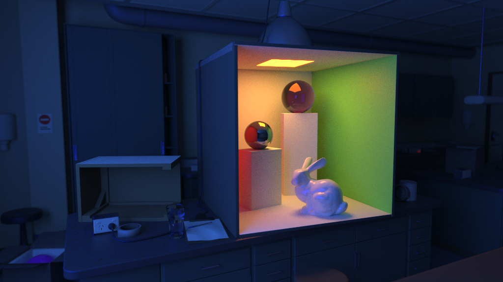
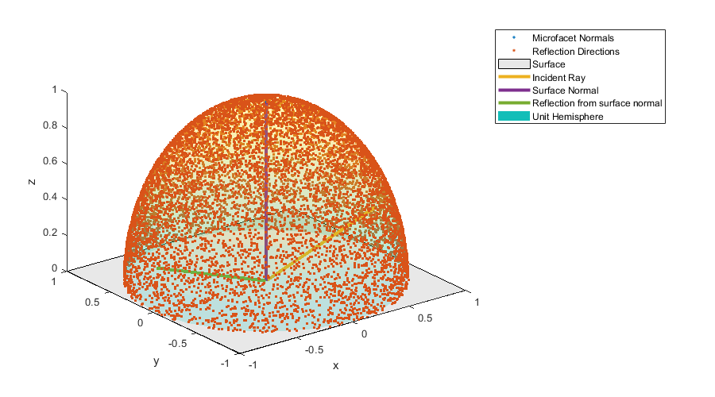
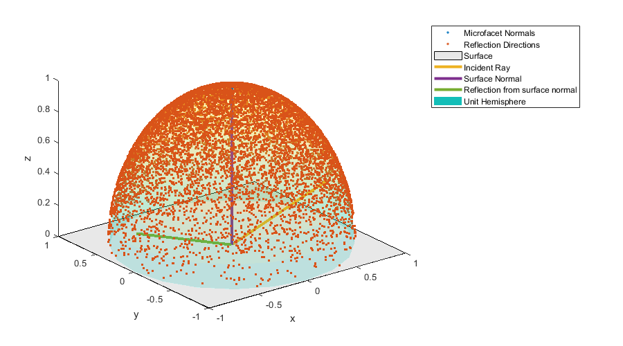
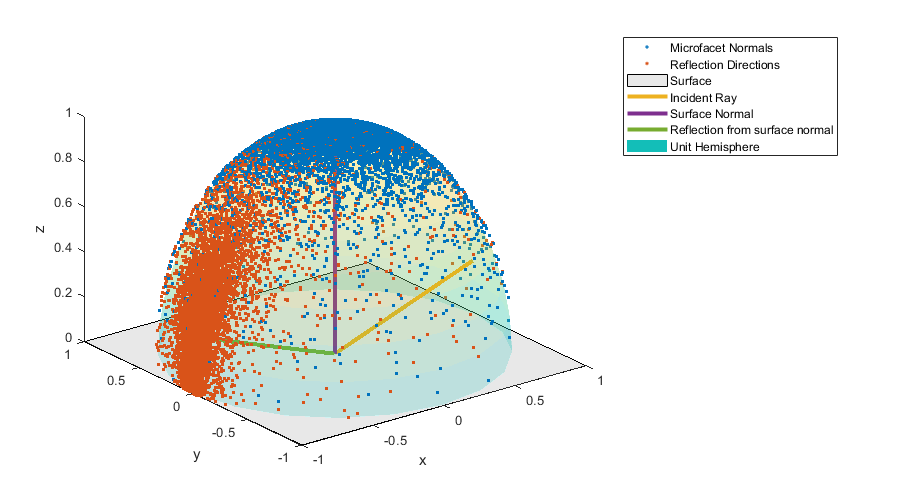
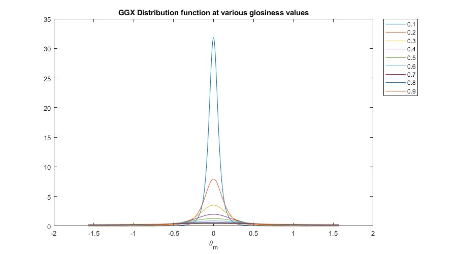
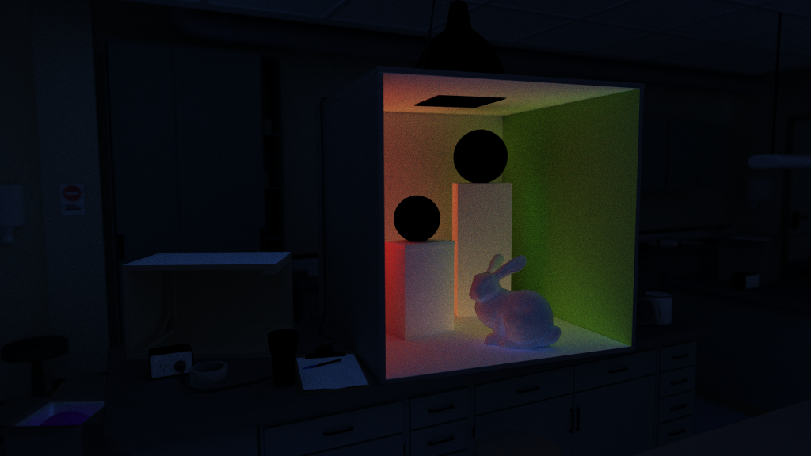
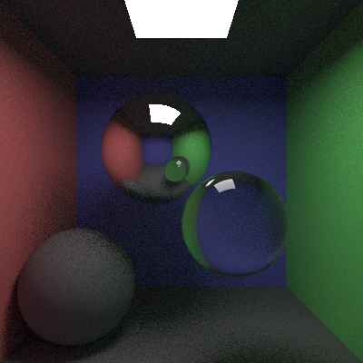
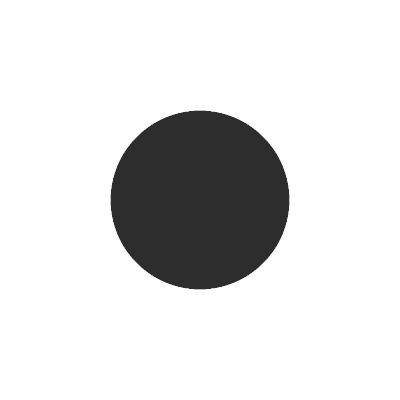
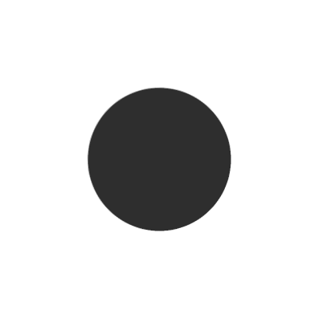

# COMP30019 Assignment 1 - Ray Tracer

## Contents

 - [Completed Stages](#completed-stages)
 - [Final Scene Render](#final-scene-render)
 - [Ambient Lighting](#ambient-lighting)
 - [OBJ Models](#obj-models)
 - [Quasirandom Numbers](#quasirandom-numbers)
 - [Custom program options](#custom-program-options)
 - [Custom scene items](#custom-scene-items)
 - [Tests](#tests)
 - [Future Improvements](#future-improvements)
 - [References](#references)

## Completed stages

##### Stage 1

- [x] Stage 1.1 - Familiarise yourself with the template
- [x] Stage 1.2 - Implement vector mathematics
- [x] Stage 1.3 - Fire a ray for each pixel
- [x] Stage 1.4 - Calculate ray-entity intersections
- [x] Stage 1.5 - Output primitives as solid colours

##### Stage 2

- [x] Stage 2.1 - Diffuse materials
- [x] Stage 2.2 - Shadow rays
- [x] Stage 2.3 - Reflective materials
- [x] Stage 2.4 - Refractive materials
- [x] Stage 2.5 - The Fresnel effect
- [x] Stage 2.6 - Anti-aliasing

##### Stage 3

- [x] Option A - Emissive materials (+6)
- [x] Option B - Ambient lighting/occlusion (+6)
- [x] Option C - OBJ models (+6)
- [x] Option D - Glossy materials (+3)
- [x] Option E - Custom camera orientation (+3)
- [x] Option F - Beer's law (+3)
- [x] Option G - Depth of field (+3)


## Final scene render



I used the following command to render the image exactly as shown:

```
dotnet run -c Release -- -f scenes/lab/Lab_06.txt -o images/final_scene.png -d 8 -l -m -g -w 1024 -h 576 --scale 1.0 -x 13 --post --prog --dof
```

## Ambient Lighting
My overall approach to ambient lighting was to implement a path tracer with multiple importance sampling (MIS). This was done in several stages which I have detailed below.

Note: Matlab code for generating the figures in this section can be found in `src\external\matlab`

#### Naive approach
First I made a completely naive path tracer for diffuse surfaces. This meant that at every intersection, a bounce ray was fired in a completely random direction based on a hemisphere aligned with the surface at that point (see *figure 1*). Then when a bounce ray eventually hit an emissive surface, the light information would propogate through to the previous bounces. At each bounce, the light information would be attenuated by multiplying by the surface colour and the dot product of the surface normal. To prevent infinite bounces, if no light source was reached after a set number of bounces, black was returned.


<div style="text-align: center; display: flex; flex-direction: column"><i>


Figure 1: Uniform sampling the unit hemisphere
</i></div>

The resulting renders were completely black, since the probability of a randomly directed ray hitting a point light source is 0. I made a new light type called a plane light. This is essentially two triangles to make a rectangle with a basic emissive material applied. The light multiplier is divided by the light area to ensure that the same energy is emitted, regardless of size (with a smaller light producing more light per unit area). I also made a matrix struct with the ability to construct translation, rotation and scale matrices to aid in positioning the light.

This resulted in renders that looked correct but had a high amount of noise, since the chance of randomly hitting the light source was still pretty low.

#### Multiple Importance Sampling

The next step was to implement MIS. MIS is a general term that covers any method that bounces rays based on a sampling algorithm that isn't completely uniform like in *figure 1*. Technically two or more methods should be employed and then combined, otherwise it would just be "importance sampling".

Since the rendering equation has that cos θ in it (dot product of light direction with surface normal), if the hemisphere is sampled in a way that's proportional to the cos θ value, I can essentially kill two birds with one stone. First, I can cancel out that cos θ multiplication, second -- and more importantly -- I can sample in directions more likely to have a greater contribution to the final result. Fortunately, there is a fairly straightforward algorithm for calculating a cosine weighted hemisphere and it results in a sampling pattern visualised in *figure 2*.

<div style="text-align: center; display: flex; flex-direction: column"><i>


Figure 2: Cosine weighted sampling the unit hemisphere
</i></div>

Even though this results in less noise, there are still a lot of rays which never find the light source, especially if it's small. This is where Next Event Estimation (NEE) comes in. This algorithm loops through all the lights in the scene and fires a ray at a random point on each light and combines the result with the other bounces. If one of the cosine weighted rays also happens to hit the light source, it reports black, since the energy from that light has already been counted. The result is images with significantly less noise (see the [Tests](#tests) section for an example). Finally point lights can be rendered again.

To properly determine the amount of light hitting the surface of an object, distance, area and angle away from the normal are all taken into account with plane-lights. With point lights only the distance is taken into account (obviously it doesn't make sense to use the area or normal of a point light)

#### Importance sampling a glossy shader
Since I implemented a glossy shader based on the GGX Bidirectional Reflection Distribution Function (BRDF), this also required importance sampling in order to render efficiently. This proved to be a lot more challenging. A glossy shader can be anything from completely diffuse to completely mirror reflective, depending on the roughness value. Fortunately, Eric Heitz has [published an algorithm](https://hal.archives-ouvertes.fr/hal-01509746/document) which can sample microfacet normals according to the GGX BRDF exactly, see *figure 3*.

<div style="text-align: center; display: flex; flex-direction: column"><i>


Figure 3: Sampling the hemisphere according to the GGX BRDF (roughness value is 0.25)
</i></div>

As with diffuse surfaces, it is also possible to use NEE with glossy shaders, however correctly weighting the direct light and BRDF rays is tricky. Consider the scenario where there is a very shiny surface and a nearby light source. If a direct light ray is fired at a random point on the light source, the chances of that direction lining up with the perfect mirror direction is very small, so the sample will report a very small number (see *figure 4*). 


<div style="text-align: center; display: flex; flex-direction: column"><i>


Figure 4
</i></div>

#### Russian Roulette
Terminating a ray after a certain number of bounces can introduce bias to the render, the result will be darker than it should be since it is still possible that those extra bounces would contribute some light. To counteract this, I've implemented a method called Russian Roulette. Essentially, at every bounce, a random number generator is used to decide whether to continue or not with some probability. If it doesn't continue, the ray just reports black. If it does continue however, it increases the reported value by multiplying it by 1 over the probability. If an infinite number of maximum bounces are used, the result is an unbiased render (note: this can be computed because all rays will eventually terminate). In practice, I have found that a max bounce value of around 8 results in a render that looks indistinguishable from an unbiased render but is a lot faster than if no Russian Roulette is used with the same max bounce value.

#### Program structure
There are two integrators, the `RayTrace.cs` and `GlobalIllumination.cs`. When the `-l` ambient lighting flag is active, the global illumination integrator is chosen instead of the the ray tracer.

When a ray hit occurs, the integrator's `HandleHit` method is called. With both integrators, if a reflective or refractive hit is discovered, the hit is passed to the appropriate methods in the raytrace integrator. Otherwise the global illumination integrator will hand the hit to either the `Diffuse.cs` or the `Microfacet.cs` shader.

Most of the calculation is done in the shader and when new bounce rays need to be fired, the integrator `HandleHit` method is called again and the cycle starts over.

A depth value and base case prevent infinite recursion.

The raytracer integrator handles all calculations related to stages 1 and 2 of the assignment.

#### Indirect portion of final render
To more clearly see the impact of the idirect ligting, I have included the indirect lighting layer. 



## OBJ Models
To render a scene with lots of triangles, it is very inefficient to loop through every single triangle every time a ray is cast. The algorithm is run many millions of times per render so it is crucial that it is as efficient as possible.

Currently the most popular way of improving performance is to use a Bounding Volume Hierarchy (BVH). This involves making volumes (usually rectangular prisms or spheres) that encloses one or just a few triangles each. Then nesting them inside larger and larger volumes until the entire scene is enclosed. 

Finding a ray intersection works as follows: first the outer bounding volume is tested. Since it is easy to check whether a ray enters a sphere or a rectangular prism, this is very fast. If the ray does make a hit, all volumes which are direct children of the root volume are checked. If one gets a hit, its children are checked and so on until we get down to a volume containing actual triangles. At that point in time, each of the triangles are checked as normal.

The algorithm can bring the complexity for finding a triangle intersections from O(n) to O(log(n)), a considerable improvement.

The method chosen to create the BVH can have a large impact on the efficiency of the method. In the extreme case, if we imagine all the base volumes containing triangles which are as far away from each other as possible, every volume would have to be checked.

The method I chose was to split the triangles in half along a certain direction (X, Y or Z) and creating two volumes for each half. For every level in the tree, I would cycle through the direction I used. Although it's not the most performant algorithm out there, it provides good enough efficiency for this use case.

## Quasirandom Numbers
Using completely random or pseudorandom numbers for things like ray direction (which direction to bounce a ray off a completely diffuse surface) can actually lead to sub-optimal results. This is because completely random numbers often result in some level of clustering (discrepancy). Fortunately, a number of techniques have been devised that produce quasi-random patterns that share properties of random numbers but have much lower discrepancy. For this project I chose to implement a 2D Halton Sequence.

## Custom Program Options

**Note** Most camera related attributes (`cam-axis`, `cam-pos`, `cam-angle`, `aperture-radius`, and `focal-length`) don't have any affect. These should all be defined in the scene file with either a `Camera` or `DofCamera`. 

`-g` `--gamma-correction` Enable gamma correction

Since our eyes' response to light is not linear, monitors apply a gamma curve to colour values so that there is more levels in the darker regions. However, light calculations in a renderer should be done in linear space. Turning on gamma correction means that colour inputs have a 2.2 gamma curve applied to them (unless they come from Blender, in which case the gamma correction is already applied). Once the render has completed and any post effects have been applied, an inverse gamma curve is applied to the whole image, so that it looks correct when viewed on a monitor which has the usual 2.2 gamma correction built in. The result is not only more physically correct, it also looks better in almost all cases compared to images that don't use a linear workflow.

`--post` Enable post effects.

The only post effect implemented is bloom. I was finding that visible light sources had aliasing around their edges since they are so much brighter than their surroundings. Even if the light takes up only a tiny fraction of the pixel, when averaged with the surrounding colours and then clamped, the samples from the light completely dominate. Bloom works by first isolating the brightest parts of the image, blurring them and then adding them back over the top. This mimics the way bright light sources are handled with physical cameras.

`-m` `--multi-processing` Enable multi processing

Ensures all available cores are put to use instead of just one. Results in significantly lower render times. Sometimes it can be useful to turn it off for debugging but other than that, it should be enabled

`-c` `--caustics` Enable caustics

I don't do any special processing for caustic rays (rays that bounce off specular surfaces or through refractive surfaces towards a light). As such, enabling caustics causes fireflies (random bright pixels) which take a long time to converge. I recommend having this off most of the time (despite not being quite physically correct)

`-s` `--layers` Enable render layers

Turning this on will result in 7 images to be produced instead of 1:
 1. The main beauty render
 2. Direct illumination
 3. Indirect illumination
 4. Reflections
 5. Refractions
 6. Emission

The render layers can be combined manually in Photoshop by using the `Linear Dodge (Add)` blend mode to produce the final image. This can be useful if exact control is required over the final output.

`--scale` Output scale

Sometimes when working on an image, it can be useful to be able to work on smaller versions which are quicker to render. Instead of manually changing the width and the height all the time, this parameter can be used to proportionally scale the width and height. Then when it is time for the final render, remove this flag or set it to 1 and you are good to go.

`--prog` Enable progressive rendering

When enabled, the renderer renders in passes. This means that it will render just 1 camera sample per pixel, save the image and start again, progressively improving the image over time. Renders take a bit longer due to the high number of I/O operations but it means you don't have to wait for the render to be completed before seeing the results. Bad renders can be cancelled early and good renders that look smooth enough can also be cancelled early, resulting in less time waiting around for renders.

A Halton low discrepency sequence is used to determine which parts of the pixel to fire rays through. This ensures that the render can be cancelled at any time and it will still look appropriately anti-aliased for the number of passes so far.

`--dof` Enable depth of field

When turned on, and a suitable DofCamera is supplied in the scene file, the scene will be render with blurred out of focus areas.

## Custom scene items

`PhysicalMaterial material_type_(Enum) color(Color) refractive_index_(Double) emission_color(Color) emission_multiplier(Double), roughness(Double), specular_value(Double)` 

Gives greater control over the look of materials, especially glossy materials.

`PlaneLight position(Vector3) dimensions(Vector2) rotation(Vector3) color(Color) multiplier(Double)`

Allows plane lights to be included.
 - `rotation` is in Euler coordinates in the order: XYZ.
 - `dimensions` is the width and height values.

`BlenderObjModel objFilePath(String) offset(Vector3) scale(Double) rotation(Vector3) material(Material)`

Should be used in combination with the supplied Blender export plugin, ensures that normals and positions are transformed appropriately.
 - `rotation` is in Euler coordinates in the order: XYZ.

`Camera field_of_view(Double) position(Vector3) rotation(Vector3)`

Create a camera.There should be at most one `Camera` or `DofCamera` per scene file (an exception will be thrown if more than one is found).
 - `field_of_view` Horizontal field of view in degrees
 - `rotation` is in Euler coordinates in the order: XYZ.

`DofCamera field_of_view(Double) position(Vector3) rotation(Vector3) focus_distance(Double) aperture_radius(Double)`

Create a camera with depth of field attributes. There should be at most one `Camera` or `DofCamera` per scene file (an exception will be thrown if more than one is found).
 - `field_of_view` Horizontal field of view in degrees
 - `rotation` is in Euler coordinates in the order: XYZ.


`// `

Comment line, ignored (note: there needs to be a space following the double slash)
## Tests

### Next event estimation
Next event estimation works on diffuse surfaces by firing at least two rays on every hit instead of one. 
One ray directed towards a point on a known light source, the second in a random direction.
If the random ray hits the light source, it reports black, since that contribution was already accounted for.
To test that it is working correctly, there are two scenes as follows:
  1. Has an area light that can be used for next event estimation. 
  2. Has a square with emission turned and the same multiplier as the area light. 
 
If next event event estimation is working correctly, they should look the same, 
although the one with next event estimation should have less noise.

#### Commands
```
dotnet run -c Release -- -f scenes/tests/test_next_event_diffuse_off.txt -o images/test_results/next_event_diffuse_off.png -x 16 -d 8 -l -m -g
dotnet run -c Release -- -f scenes/tests/test_next_event_diffuse_on.txt -o images/test_results/next_event_diffuse_on.png -x 3 -d 8 -l -m -g
```

#### Results

Diffuse:

|Next event estimation off | Next event estimation on
|--------------------------|-------------------------
| | 
| Render time: 2m 22s | Render time: 8s
| Camera samples per pixel: 256 | Camera samples per pixel: 9 


### Furnace test
Although it is not possible to solve the rendering equation analytically in the general case, 
it is possible to solve it in some very specific ones. 
One of these cases is known as the "furnace test" and involves a diffuse sphere of a specific
colour. The camera and the sphere are enclosed in another sphere with an emission of 1.
If the global illumination algorithm is working correctly, the sphere should appear 
exacly the input colour.

#### Command
```
 dotnet run -c Release -- -f tests/test_furnace.txt -o images/test_results/furnace.png -x 2 -d 2 -l -m -g
```


#### Results
|Render|Reference
|------|----------
| | 
|Centre value: 0.18|Centre value: 0.18

## Exporting from Blender
To make life a bit easier, I have included a plugin: [src/external/python/BlenderExportPlugin.py](src/external/python/BlenderExportPlugin.py). It will generate an `.obj`, `.mtl` and `.txt` scene file.

To install:
 - Open Blender and navigate to `Edit` > `Preferences`
 - Click `Install..` 
 - Choose `BlenderExportPlugin.py` from the file browser
 - Tick the checkbox for it to enable it.

To use:
 - Open a scene you would like to render. 
 - In the Scene Properties tab there should be a new panel called `Raytracer Export Panel`. In `Root path`, choose the root directory of the renderer (i.e. where you run `dotnet run...` from). 
 - Click `Export to raytracer`

All files will be placed in the same directory that the blender file is in. I have only tested scenarios where this is a subdirectory of the root specified earlier but it should work in other cases.


## Future improvements

The main thing I would like to do is fully implement the GGX shader. This would mean 
 - The ability to read in textures
 - Glossy refraction as well as glossy reflections
 - Proper MIS

I would also like to investigate how I can improve overall render times. There are probably efficiencies I could make to this code base (I know there is a better BVH implementation out there for instance) but I suspect the biggest improvement will be made by moving the code over to C++.

It would be nice to have a window to display the current render instead of waiting for an output file.

Make use of Nvidia CUDA to render on the graphics card instead of the CPU.

## Sample outputs

We have provided you with some sample tests located at ```/tests/*```. So you have some point of comparison, here are the outputs our ray tracer solution produces for given command line inputs (for the first two stages, left and right respectively):

###### Sample 1
```
dotnet run -- -f tests/sample_scene_1.txt -o images/sample_scene_1.png -x 4
```
<p float="left">
  
   
</p>

###### Sample 2

```
dotnet run -- -f tests/sample_scene_2.txt -o images/sample_scene_2.png -x 4
```
<p float="left">
  
   
</p>


## References

Scratchapixel: https://www.scratchapixel.com/lessons/3d-basic-rendering/introduction-to-ray-tracing/how-does-it-work

Rory Driscoll, hemisphere sampling: https://www.rorydriscoll.com/2009/01/07/better-sampling/

Wikipedia, Halton Sequence: https://en.wikipedia.org/wiki/Halton_sequence

SmallPaint by Károly Zsolnai-Fehér: https://users.cg.tuwien.ac.at/zsolnai/gfx/smallpaint/

Tu Wein Rendering / Ray Tracing Course: https://www.youtube.com/playlist?list=PLujxSBD-JXgnGmsn7gEyN28P1DnRZG7qi

Nick De Bruijne, Path Tracing - Literature Research https://docplayer.net/10650617-Path-tracing-literature-research-rick-de-bruijne-may-17-2011.html

Stack Overflow, how to get a perpendicular vector: https://stackoverflow.com/questions/11132681/what-is-a-formula-to-get-a-vector-perpendicular-to-another-vector

Stephen Toub, Thread safe random number generation: https://devblogs.microsoft.com/pfxteam/getting-random-numbers-in-a-thread-safe-way/

Universiteit Utrecht Advanced Graphics slides: http://www.cs.uu.nl/docs/vakken/magr/2015-2016/index.html#downloads

Stanford Introduction to Computer Graphics: https://web.stanford.edu/class/cs148/lectures.html

Microfacet Theory: https://agraphicsguy.wordpress.com/2015/11/01/sampling-microfacet-brdf/

GGX Hemispher Sampling: https://hal.archives-ouvertes.fr/hal-01509746/document

Microfacet Models for Refraction through Rough Surfaces https://www.cs.cornell.edu/~srm/publications/EGSR07-btdf.pdf

GGX Importance Sampling by Joe Schutte https://schuttejoe.github.io/post/ggximportancesamplingpart1/

Sampling the GGX Distribution of Visible Normals by Eric Heitz: http://jcgt.org/published/0007/04/01/

Understanding the shadow masking function by Eric Heitz: http://jcgt.org/published/0003/02/03/

PBR Diffuse Lighting, GDC Presentation: https://ubm-twvideo01.s3.amazonaws.com/o1/vault/gdc2017/Presentations/Hammon_Earl_PBR_Diffuse_Lighting.pdf

Crash Course in BRDF Implementation by Jacob Boksansky https://boksajak.github.io/blog/BRDF

OBJ .mtl file info http://paulbourke.net/dataformats/mtl/

Path tracing shader toy https://www.shadertoy.com/view/XdVfRm